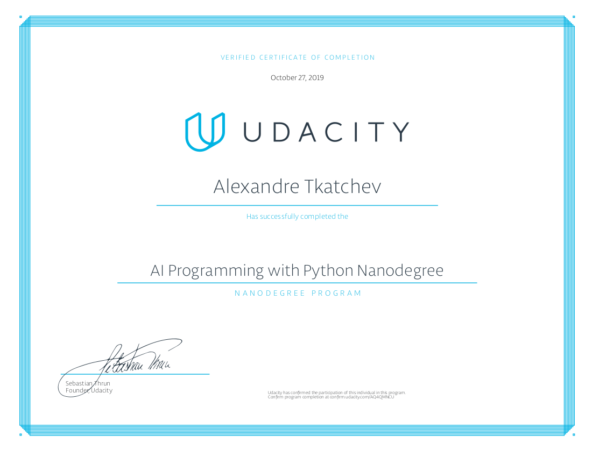

# Artificial Intelligence Programming with Python Nanodegree Program
This Artificial Intelligence (AI) Programming with Python Nanodegree Program focused on a project oriented approach focusing on the the fundamental building blocks to becoming an AI practitioner using Python. Specific concentration in programming skills, and essential mathematics for building an AI architecture. The Nanodegree program showed the process of utilizing a pre-trained neural network architecture and implementing them in various applications.

# Projects
- [Project 1](https://github.com/atkatchev/intropyproject-classify-pet-images) - **Pet Image Classifier** -  Developed image classification application, to assist in a citywide dog show to assist in registration, using a deep learning model called a **convolutional neural network** (CNN). The CNN was pre-trained on the ImageNet data-set of 1.2 million images. Used the CNN to classify whether the image is or is not a dog. Explored the three different architectures (AlexNet, VGG, and ResNet) and determined which architecture performed best for this application.
- [Project 2](https://github.com/atkatchev/image-classification-application) - **Flower Species Image Classifier** - Used a pre-trained **convolutional neural network** (CNN) developed with PyTorch. The pre-trained CNN model extracts image features. Built and trained classifier of the CNN model to recognize different species of flowers. A data-set of 102 flower categories was used. The project consisted of two parts, the first part consists of a jupyter notebook with the initial version of the classifier and the second part is a command line application.

# Link
- [Udacity](https://www.udacity.com/course/ai-programming-python-nanodegree--nd089)

# Nanodegree

